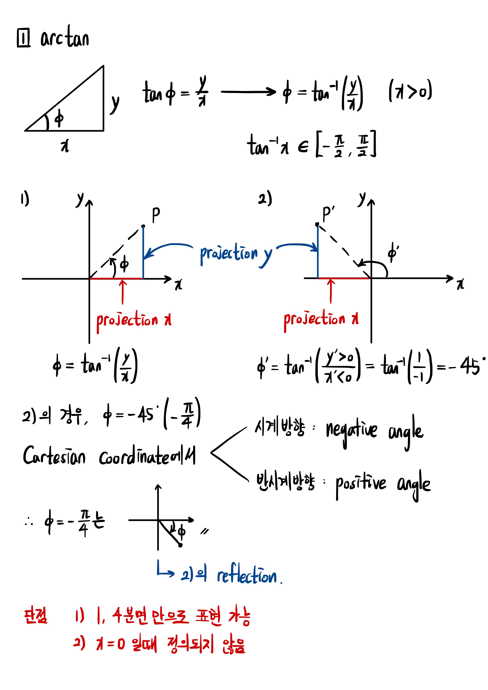
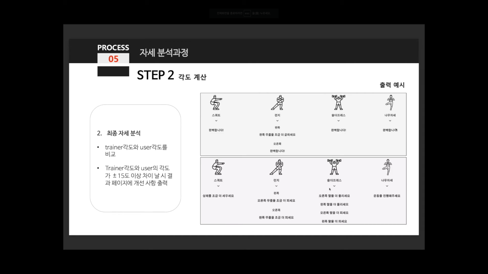

# 필기 노트 4

## arctan2를 이용하는 수학적 원리 리서치 🏫 [link](https://www.youtube.com/watch?v=hZ2CuusMyCM)

∴ `arctan2`를 사용함으로써 모든 각도를 표현할 수 있고, 결측치 발생의 위험도 줄일 수 있음

(추가) **ChatGPT가 말하는 `arctan2`를 쓰는 이유**

arctan2 함수는 arctan 함수와 비교하여 몇 가지 이점이 있습니다.
주된 이유는 arctan2 함수가 두 점이 주어졌을 때의 각도를 정확하게 계산할 수 있기 때문입니다.

arctan 함수는 y/x의 비율을 취하여 각도를 계산합니다. 그러나 이 함수는 x 값이 0인 경우 문제가 발생합니다.
x 값이 0이면 arctan 함수는 정의되지 않으며, 결과는 결측값이 됩니다.
이는 특히 코디네이트를 사용하여 각도를 계산할 때 문제가 될 수 있습니다.
arctan2 함수는 이러한 문제를 해결하기 위해 x 및 y 좌표를 개별적으로 사용하여 정확한 각도를 계산합니다.

또한 arctan2 함수는 양수와 음수의 부호를 고려하여 각도를 계산합니다.
이는 점의 위치에 따라 적절한 사분면을 선택하여 각도를 계산하는 데 도움이 됩니다.
arctan 함수는 단일 값을 반환하므로 부호 정보를 사용할 수 없습니다.

따라서 arctan2 함수는 두 점이 주어졌을 때 정확한 각도를 계산할 수 있으며, x 및 y 좌표의 부호를 고려하여 적절한 사분면을 선택합니다.
이는 pose estimation과 같은 작업에서 정확한 각도를 얻기 위해 arctan2 함수를 선호하는 이유입니다.

---
## arctan2로 구현한 유사 사례 레퍼런스 수집
- Kaggle Pose Estimation [link](https://www.kaggle.com/code/venkatkumar001/yoga-pose-recognition-mediapipe/notebook)
- Youtube Pose Estimation [link](https://www.youtube.com/watch?v=aySurynUNAw)
- 숙명여대 프로젝트 Youtube [link](https://www.youtube.com/watch?v=N6EWDagqVVI)
- 숙명여대 프로젝트 Github [link](https://github.com/jokj624/AIhomeTraining_web)

